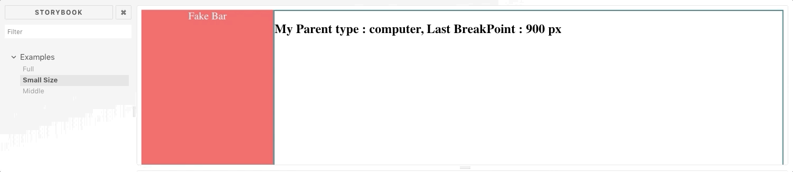
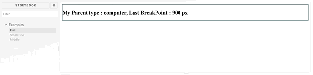

# react-element-based-device-dedector

This library for dedecting device type from parent dom.

Demo : http://panoramic-cake.surge.sh/

 ## Getting started
 
 1.  Install with yarn:
 
 ```shell
 yarn add react-element-based-device-dedector
 ```
 
 or with npm:
 
 ```shell
 npm install react-element-based-device-dedector
 ```
 
 ## Usage
 
 ```jsx
 import React, { Component } from 'react';
 import { render } from 'react-dom';
 import ReactResizeDetector from 'react-resize-detector';
 import ElementBasedDeviceDedector from 'element-based-device-dedector';

const devices = [
  {
    name: 'mobile1',
    breakpointPx: 300,
  },
  {
    name: 'mobile2',
    breakpointPx: 400,
  },
  {
    name: 'mobile3',
    breakpointPx: 500,
  },
  {
    name: 'mobile4',
    breakpointPx: 600,
  },
];
 
 class App extends PureComponent {
     state = {
       type: null,
       lastBreakpoint: null,
     };
 
 handleChangeType = (name, lastBreakpoint) => {
     // set state or do whatever want
     this.setState({
       type : name,
       lastBreakpoint,
     });
   };
   
   render() {
     return (
       <div>
         ...
        <ElementBasedDeviceDedector onChangeType={this.handleChangeType}/>
       </div>
     );
   }
 
   onResize = () => {
     ...
   }
 }
 
 render(<App />, document.getElementById('root'));
 ```
 
## Storybook Examles
  ```shell
  git clone https://github.com/hlthi/react-element-based-device-dedector.git
  cd react-element-based-device-dedector
  yarn storybook
  ```
  
## Example Gifs
  - Middle
  
  
  - Small
   
   
  - Full
   
 
Live : http://panoramic-cake.surge.sh/
 
 ## API
 
 | Prop               | Type   | Description                                                                                                                                                                                            | Default     |
 | ------------------ | ------ | ------------------------------------------------------------------------------------------------------------------------------------------------------------------------------------------------------ | ----------- |
 | onChangeType       | Func   | Function that will be invoked with `name` and `lastBreakpointPx` arguments                                                                                                                                      | n/a         |
 | skipOnMount        | Bool   | Do not trigger onChangeType when a component mounts                                                                                                                                                        | `false`     |
 | resizableElementId | String | Id of the element we want to observe. If none provided, parentElement of the component will be used                                                                                                    | `undefined` |
 | refreshMode        | String | Possible values: `throttle` and `debounce` See [lodash docs](https://lodash.com/docs#debounce) for more information. `undefined` - means that callback will be fired as often as ResizeObserver allows | `undefined` |
 | refreshRate        | Number | Only makes sense when `refreshMode` is set. Important! It's a numeric prop so set it accordingly, e.g. `refreshRate={500}`                                                                             | `1000`      |
